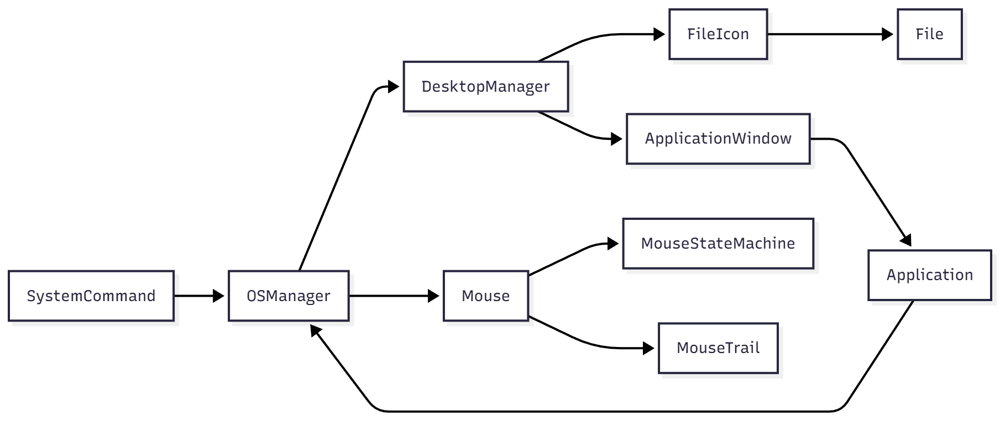
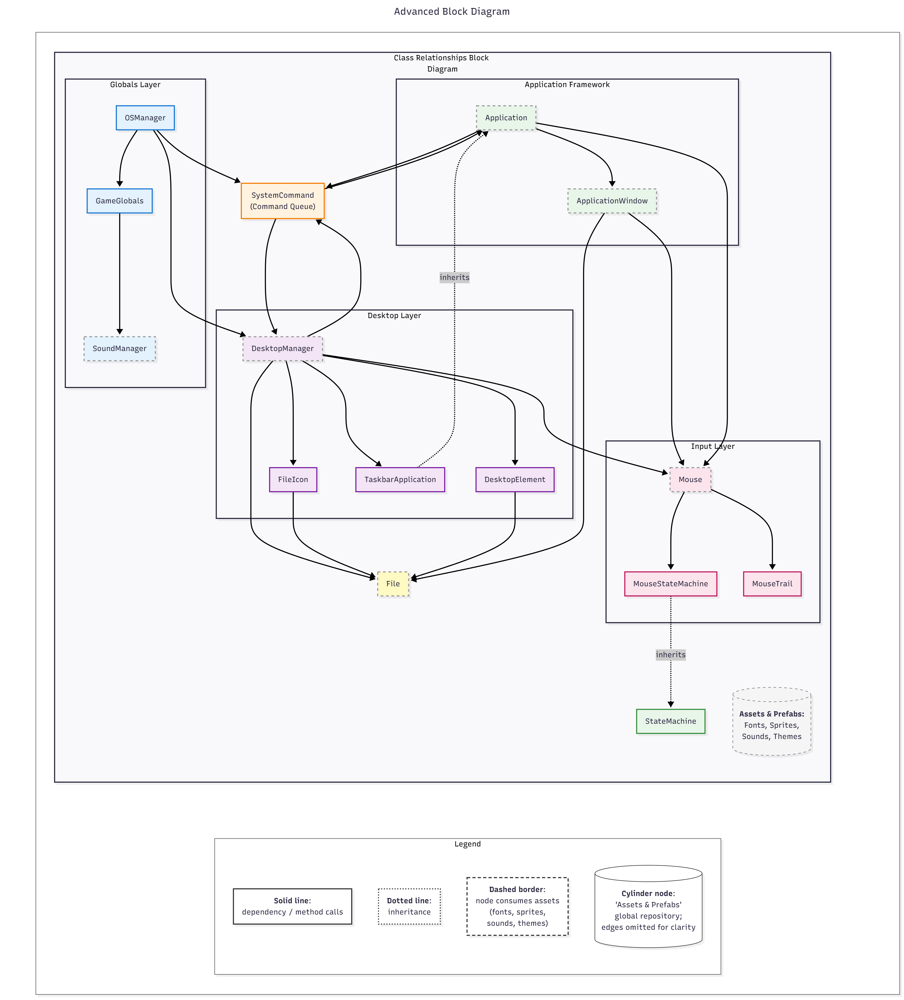
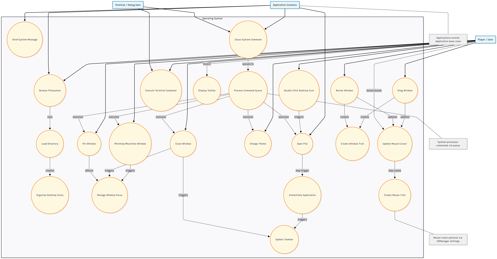
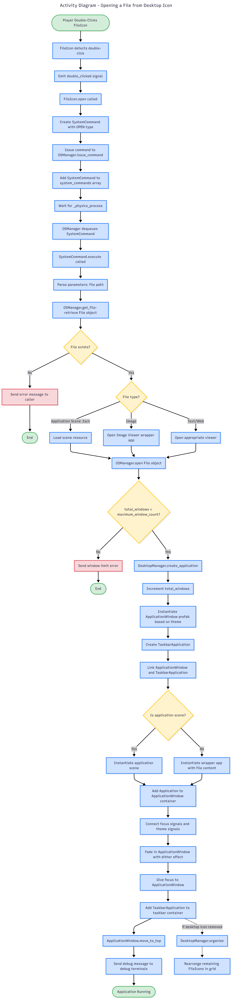
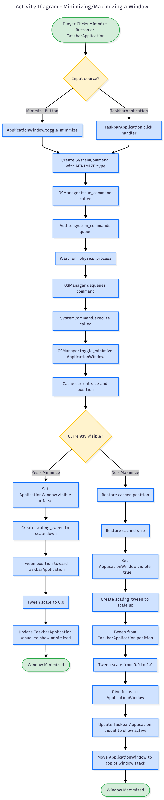
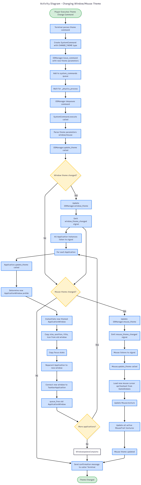
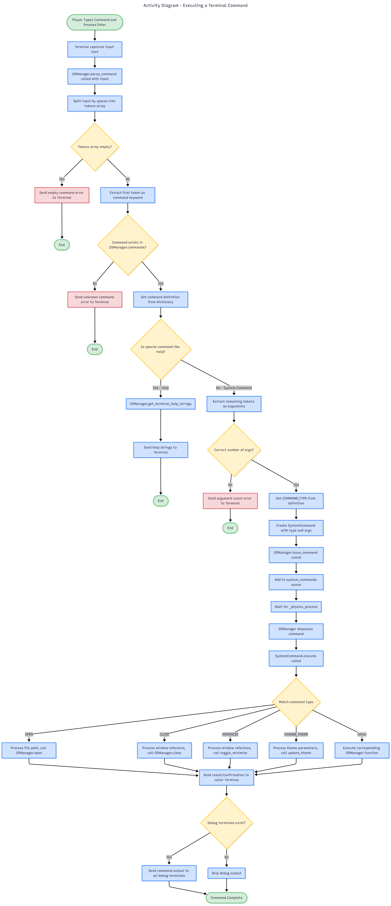
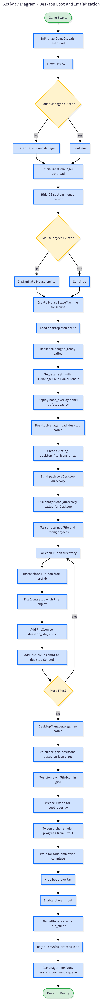

# System Architecture Diagrams

This page contains various diagrams illustrating the architecture, flows, and interactions within the OS simulator project.

---

## Table of Contents
- [Block Diagram](#block-diagram)
- [Use Case Diagram](#use-case-diagram)
- [Activity Diagrams](#activity-diagrams)
  - [Opening a File from Desktop Icon](#opening-a-file-from-desktop-icon)
  - [Closing an Application Window](#closing-an-application-window)
  - [Minimizing/Maximizing a Window](#minimizingmaximizing-a-window)
  - [Changing Window/Mouse Theme](#changing-windowmouse-theme)
  - [Executing a Terminal Command](#executing-a-terminal-command)
  - [Desktop Boot and Initialization](#desktop-boot-and-initialization)

---

## Block Diagram

This diagram shows the high-level architecture of the system, including the main components and their relationships.

### Architecture Overview
The system is organized into several key layers:
- **Globals**: System-wide managers (OSManager, GameGlobals, SoundManager)
- **Command Queue**: Event dispatch system (SystemCommand)
- **Application Framework**: Base classes for applications and windows
- **Desktop Layer**: Visual desktop elements and management
- **Filesystem**: Virtual file system
- **Input/Mouse**: Custom cursor and state management
- **Resources**: Assets and data files

### Advanced Block Diagram

This expanded diagram provides a more detailed view of class-level relationships, data/control flow, and layer boundaries. It emphasizes:
- Invocation paths between `Application`, `ApplicationWindow`, and the `SystemCommand` queue
- Desktop layer elements (`DesktopManager`, `FileIcon`, `TaskbarApplication`, `DesktopElement`) and their interactions
- Mouse input flow and internal state machine composition
- Separation of global managers from window/application framework logic
- Resource/asset consumption (indicated via dashed borders) without cluttering the diagram with individual asset arrows

Use this when you need to reason about how commands propagate, where state transitions occur, or which components depend on global services.

---

## Use Case Diagram

This diagram illustrates the main actors (Player, Application, Terminal) and their interactions with the operating system.

### Key Actors
- **Player/User**: End user interacting with the desktop environment
- **Application Instance**: Running applications that can issue system commands
- **Terminal/Debug User**: Advanced user executing terminal commands

### Primary Use Cases
- Window management (open, close, minimize, drag, resize, pin)
- Theme customization
- File system navigation
- Command execution
- Visual effects (mouse trails, window trails, tooltips)

---

## Activity Diagrams

Activity diagrams show the detailed flow of operations for key system workflows.

### Opening a File from Desktop Icon

This diagram shows the complete flow from double-clicking a desktop icon to launching the application in a window.

**Key Steps:**
1. Player double-clicks FileIcon
2. SystemCommand created and queued
3. OSManager processes command from queue
4. File type determined (application scene vs. wrapper)
5. ApplicationWindow created with appropriate theme
6. TaskbarApplication created and linked
7. Application instantiated and displayed

---

### Closing an Application Window

This diagram shows the cleanup process when closing an application window.

**Key Steps:**
1. Player clicks close button
2. SystemCommand created for CLOSE operation
3. Window properties cached for animation
4. Dither dissolve effect applied
5. Window removed from pinned/system message lists
6. TaskbarApplication removed
7. Resources freed

---

### Minimizing/Maximizing a Window

This diagram shows the toggle behavior for window minimization and restoration.

**Key Steps:**
- **Minimize Path**: Window scaled down to taskbar with tween animation
- **Maximize Path**: Window restored from taskbar with reverse tween
- Both paths update TaskbarApplication visual state
- Focus management handled during maximize

---

### Changing Window/Mouse Theme

This diagram shows the system-wide theme update process triggered by terminal commands.

**Key Steps:**
1. Terminal command parsed for theme change
2. SystemCommand queued and executed
3. OSManager updates theme variables
4. Signals emitted to all listening components
5. **Window Theme Path**: Each Application recreates its window with new theme prefab
6. **Mouse Theme Path**: Mouse updates spritesheet and all active trails

---

### Executing a Terminal Command

This diagram shows the parsing, validation, and execution of terminal commands.

**Key Steps:**
1. Player types command and presses Enter
2. Input split into tokens (command + arguments)
3. Command lookup in OSManager.commands dictionary
4. Special handling for non-system commands (e.g., `help`)
5. Validation of argument count
6. SystemCommand created and queued
7. Execution routes to appropriate OSManager function
8. Output sent to caller and debug terminals

---

### Desktop Boot and Initialization

This diagram shows the complete boot sequence from game start to desktop ready state.

**Key Steps:**
1. Game starts, autoload globals initialized
2. GameGlobals sets up SoundManager
3. OSManager hides system cursor and creates custom Mouse
4. Desktop scene loaded, DesktopManager initialized
5. Boot overlay displayed at full opacity
6. Desktop directory loaded, FileIcons created for each file
7. Icons organized in grid layout
8. Boot overlay fades out with dither effect
9. Input enabled, physics loop begins monitoring command queue

---

## Additional Resources

For more detailed information about specific classes and their APIs, see:
- [Class Reference Documentation](../README.md#classes)
- [Getting Started Guide](./1-getting-started.md)
- [OS Control Flow](./2-os-control-flow.md)
- [Making Applications](./3-making-applications.md)

---

*Last updated: November 13, 2025*
